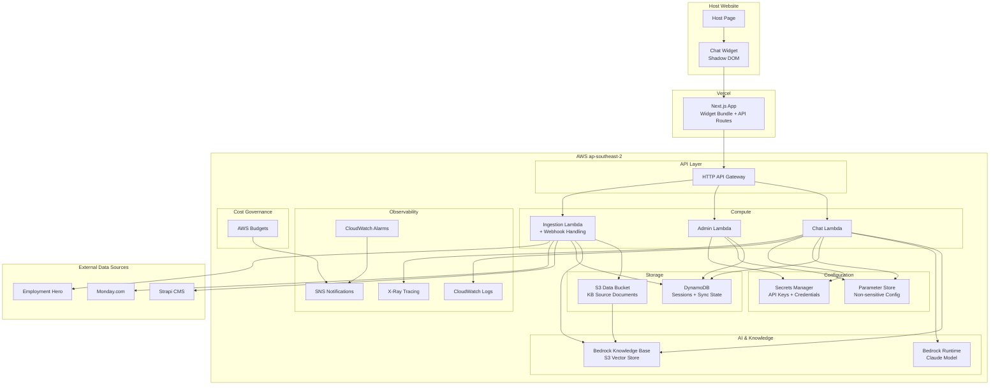
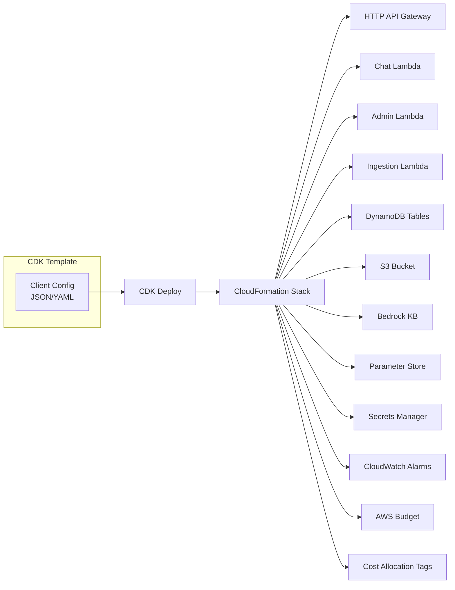

# Design Document: AWS Managed Chatbot

## Overview

This is an embeddable RAG (Retrieval-Augmented Generation) chatbot platform with a split architecture: a Next.js chat widget hosted on Vercel and an AWS serverless backend. Each client receives isolated infrastructure deployed from a cloneable CDK template, ensuring complete data separation and independent scaling.

The system is designed in three phases: Phase 1 covers the chat flow (widget + backend conversation handling), Phase 2 adds content ingestion with data source connectors, and Phase 3 layers in security hardening and observability. All phases share a single-tenant CDK stack deployed to `ap-southeast-2`.

The widget embeds into any host page via a single script tag with Shadow DOM isolation. The backend orchestrates retrieval from Bedrock Knowledge Base, streams responses via Vercel AI SDK (SSE), and manages chat sessions in DynamoDB. Content enters the system through adapter-based connectors supporting initial ingestion, incremental sync, and direct record operations.

## Architecture

### System Context



### Deployment Architecture (Per-Client Stack)



## Components and Interfaces

### Component 1: Chat Widget (Vercel / Next.js)

**Purpose**: Embeddable UI component that provides the chat interface within a host page, fully isolated via Shadow DOM.

**Interface**:

```typescript
// Embed snippet (rendered as script tag on host page)
interface WidgetConfig {
  clientId: string;
  apiEndpoint: string;
}

// Widget internal state
interface WidgetState {
  isExpanded: boolean;
  sessionToken: string | null;
  messages: ChatMessage[];
  isStreaming: boolean;
  error: WidgetError | null;
}

// Branding applied from build-time config (env vars or static JSON in Next.js deployment)
// NOT fetched from AWS at runtime — changes deploy with Vercel redeploy
interface BrandingConfig {
  primaryColour: string; // hex, auto-contrast corrected
  accentColour: string; // hex, auto-contrast corrected
  logoUrl: string | null; // 40x40px max; points to client-hosted CDN or Vercel deployment (no dedicated S3 bucket)
  welcomeMessage: string;
  bubblePosition: "bottom-right" | "bottom-left";
}
```

**Responsibilities**:

- Render chat UI inside Shadow DOM container
- Stream responses via Vercel AI SDK (SSE)
- Manage expand/collapse animations (< 300ms)
- Handle error states with retry UX
- Apply branding configuration from build-time env vars / static config (no runtime API call)
- Enforce responsive layout (320px–2560px)
- Maintain 44x44px minimum touch targets

---

### Component 2: HTTP API Gateway

**Purpose**: Single entry point for all backend requests with routing, CORS enforcement, and rate limiting.

**Interface**:

```typescript
// Route definitions
interface APIRoutes {
  // Phase 1: Chat (handled by Chat Lambda)
  "POST /chat": ChatHandler;
  "POST /session": SessionHandler;
  "GET /session/{sessionId}": SessionStatusHandler;

  // Phase 2: Ingestion (handled by Ingestion Lambda)
  "POST /webhook/{source}": IngestFn; // webhook validation + ingestion
  "POST /ingest/record": IngestFn;
  "DELETE /ingest/record/{recordId}": IngestFn;

  // Phase 3: Admin (handled by Admin Lambda)
  "GET /admin/config": AdminConfigHandler;
  "PUT /admin/config": AdminConfigUpdateHandler;
  "GET /admin/sync-status": SyncStatusHandler;
  "POST /admin/sync/trigger": SyncTriggerHandler;
  "GET /admin/analytics": AnalyticsHandler;
}

// Common request context
interface RequestContext {
  apiKey: string; // x-api-key header
  clientId: string; // derived from API key
  requestId: string; // auto-generated
  sessionToken?: string; // x-session-token header
  origin: string; // for CORS validation
}
```

**Responsibilities**:

- Route requests to appropriate Lambda functions
- Validate API keys (widget key vs admin key)
- Enforce CORS (configured origins only)
- Apply rate limiting (default 30 req/min per session)
- Generate request IDs for tracing
- Enable X-Ray tracing propagation

---

### Component 3: Chat Lambda

**Purpose**: Handles chat requests — retrieves context from Bedrock KB, generates grounded responses, manages session state, and streams results.

**Chat Interface**:

```typescript
interface ChatRequest {
  message: string;
  sessionId: string;
}

interface ChatResponse {
  // Streamed via SSE
  type: "token" | "citation" | "done" | "error";
  data: string | CitationMetadata | CompletionMetadata;
}

interface CitationMetadata {
  sourceRecordId: string;
  title: string;
  relevanceScore: number;
}

interface CompletionMetadata {
  sessionId: string;
  turnCount: number;
  tokensUsed: number;
}
```

**Responsibilities**:

- Validate session (expiry, turn limit, token budget)
- Retrieve context from Bedrock KB with metadata filters
- Apply confidence threshold (default 0.5) for no-answer fallback
- Constrain LLM to retrieved context via system prompt
- Stream tokens via SSE (first token < 3s p95)
- Update session state in DynamoDB
- Emit structured JSON logs with latency tracking

---

### Component 4: Admin Lambda

**Purpose**: Provides administrative operations for configuration management, sync control, and analytics.

**Admin Interface**:

```typescript
interface AdminOperations {
  getConfig(): ClientConfig;
  updateConfig(partial: Partial<ClientConfig>): void;
  triggerSync(sourceType: string): AsyncOperationStatus;
  getSyncStatus(): SyncStatusReport;
  getAnalytics(range: DateRange): AnalyticsReport;
}

interface AsyncOperationStatus {
  operationId: string;
  status: "pending" | "running" | "complete" | "failed";
  statusUrl: string; // polling URL
  startedAt: string;
  completedAt?: string;
}
```

**Responsibilities**:

- Authenticate via admin API key (separate from widget keys)
- CRUD operations on client configuration (rate limits, session, data source, monitoring — NOT branding)
- Trigger and monitor long-running sync operations
- Aggregate chat analytics
- Return status URLs for async operations

---

### Component 5: Ingestion Lambda

**Purpose**: Manages content ingestion from external data sources into Bedrock Knowledge Base via the adapter pattern. Also handles webhook validation and routing as a consolidated entry point for all ingestion-related operations.

**Interface**:

```typescript
interface IngestionEvent {
  type: "full-sync" | "incremental" | "upsert" | "delete" | "webhook";
  sourceType: "strapi" | "monday" | "employment-hero";
  recordId?: string;
  record?: ContentRecord;
  checkpoint?: string;
  webhook?: WebhookPayload; // populated when type = "webhook"
  signature?: string; // webhook signature for validation
}

interface WebhookPayload {
  event: "create" | "update" | "delete";
  recordId: string;
  timestamp: string;
  data?: Record<string, unknown>;
}

interface IngestionResult {
  recordsProcessed: number;
  recordsFailed: number;
  checkpoint: string;
  durationMs: number;
  status: "complete" | "in-progress" | "failed";
  resumeToken?: string;
}
```

**Responsibilities**:

- Execute full ingestion on stack deployment (< 15 min)
- Run scheduled full-sync every 7 days as a safety net (configurable; webhooks handle real-time changes)
- Paginate source data (configurable page size, default 100)
- Transform source records to common format
- Upsert/delete records in Bedrock KB S3 data source
- Persist sync progress for resume capability
- Retry failed operations (3x, exponential backoff)
- Log progress every 100 records
- Validate webhook signatures (HMAC verification using shared secret)
- Deduplicate webhook notifications (check DynamoDB dedup table before processing)
- Route validated webhook events to appropriate ingestion handler
- Process webhook events within 60 seconds

---

### Component 6: Data Source Adapter (Plugin Pattern)

**Purpose**: Abstracts external data source interactions behind a common interface, enabling runtime selection and future extensibility.

**Interface**:

```typescript
interface DataSourceAdapter {
  listContent(
    pagination: PaginationParams,
  ): Promise<PagedResult<ContentRecord>>;
  fetchById(recordId: string): Promise<ContentRecord | null>;
  detectChanges(since: string): Promise<ChangeSet>;
}

interface ContentRecord {
  recordId: string;
  contentBody: string;
  contentType: string;
  metadata: Record<string, string>;
  lastModified: string; // ISO 8601
}

interface ChangeSet {
  created: ContentRecord[];
  updated: ContentRecord[];
  deleted: string[]; // record IDs
  checkpoint: string; // opaque cursor for next call
}

interface PaginationParams {
  pageSize: number; // default 100
  cursor?: string;
}
```

**Responsibilities**:

- Implement adapter interface per data source
- Handle source-specific authentication
- Transform source-specific formats to `ContentRecord`
- Support pagination for large datasets
- Detect changes since last checkpoint
- Retry HTTP calls 3x with exponential backoff (1s base, 10s max)

---

### Component 7: Configuration Service

**Purpose**: Centralised configuration access layer that caches values during Lambda execution lifecycle and supports hot-reload within 5 minutes.

**Interface**:

```typescript
interface ConfigurationService {
  getConfig(clientId: string): ClientConfig;
  getDataSourceConfig(clientId: string): DataSourceConfig;
  getSecrets(clientId: string): SecretValues;
  invalidateCache(): void;
}

interface ClientConfig {
  clientId: string;
  dataSource: DataSourceConfig;
  rateLimits: RateLimitConfig;
  session: SessionConfig;
  monitoring: MonitoringConfig;
  // Note: branding is NOT managed here — it's configured in the Next.js Vercel deployment
}
```

**Responsibilities**:

- Read from Parameter Store (non-sensitive) and Secrets Manager (credentials)
- Cache config during Lambda execution environment lifecycle
- Refresh cache on cold starts or after 5-minute TTL
- Provide typed access to all configuration domains
- Shared by both Chat Lambda and Admin Lambda (each instance caches independently)

## Data Models

### DynamoDB Table: Sessions

| Attribute         | Type   | Description                                  |
| ----------------- | ------ | -------------------------------------------- |
| `PK`              | String | `SESSION#{sessionId}`                        |
| `SK`              | String | `META`                                       |
| `clientId`        | String | Client identifier                            |
| `createdAt`       | String | ISO 8601 creation time                       |
| `lastActiveAt`    | String | ISO 8601 last activity                       |
| `turnCount`       | Number | Current turn count                           |
| `tokensUsed`      | Number | Cumulative tokens consumed                   |
| `sessionDuration` | Number | Configured TTL in minutes                    |
| `turnLimit`       | Number | Max turns allowed                            |
| `tokenBudget`     | Number | Max tokens allowed                           |
| `status`          | String | `active` \| `expired` \| `exhausted`         |
| `TTL`             | Number | Unix epoch for DynamoDB auto-delete (7 days) |

**Access Patterns**:

- Get session by ID: `PK = SESSION#{sessionId}, SK = META`
- Session messages: `PK = SESSION#{sessionId}, SK = TURN#{turnNumber}`

### DynamoDB Table: Sessions — Message Items

| Attribute    | Type   | Description             |
| ------------ | ------ | ----------------------- |
| `PK`         | String | `SESSION#{sessionId}`   |
| `SK`         | String | `TURN#{turnNumber}`     |
| `role`       | String | `user` \| `assistant`   |
| `content`    | String | Message text            |
| `citations`  | List   | Citation metadata array |
| `tokensUsed` | Number | Tokens for this turn    |
| `timestamp`  | String | ISO 8601                |
| `TTL`        | Number | Same as session TTL     |

### DynamoDB Table: Sync State

| Attribute             | Type   | Description                         |
| --------------------- | ------ | ----------------------------------- |
| `PK`                  | String | `SYNC#{sourceType}`                 |
| `SK`                  | String | `STATE`                             |
| `clientId`            | String | Client identifier                   |
| `lastFullSync`        | String | ISO 8601 last full sync completion  |
| `lastIncrementalSync` | String | ISO 8601 last incremental sync      |
| `checkpoint`          | String | Opaque cursor for change detection  |
| `recordsIngested`     | Number | Total records in KB                 |
| `status`              | String | `idle` \| `running` \| `failed`     |
| `lastError`           | String | Last error message if failed        |
| `progressRecords`     | Number | Records processed in current run    |
| `totalRecords`        | Number | Total records to process            |
| `resumeToken`         | String | Token for resuming interrupted sync |

**Access Patterns**:

- Get sync state: `PK = SYNC#{sourceType}, SK = STATE`
- Sync history: `PK = SYNC#{sourceType}, SK = RUN#{timestamp}`

### DynamoDB Table: Webhook Deduplication

| Attribute     | Type   | Description                  |
| ------------- | ------ | ---------------------------- |
| `PK`          | String | `WEBHOOK#{source}#{eventId}` |
| `SK`          | String | `DEDUP`                      |
| `processedAt` | String | ISO 8601                     |
| `TTL`         | Number | Auto-delete after 24 hours   |

**Access Patterns**:

- Check if webhook processed: `PK = WEBHOOK#{source}#{eventId}`

### S3 Data Bucket Structure

```
s3://{client-id}-kb-data/
├── documents/
│   ├── {recordId}.json          # Individual content records
│   └── ...
├── metadata/
│   ├── {recordId}.metadata.json # Bedrock KB metadata files
│   └── ...
└── sync/
    └── progress/
        └── {sourceType}-{timestamp}.json  # Sync progress snapshots
```

### Content Record Format (S3 Document)

```typescript
interface S3ContentDocument {
  recordId: string;
  contentBody: string;
  contentType: string;
  sourceType: string;
  metadata: {
    clientId: string;
    title: string;
    lastModified: string;
    sourceUrl?: string;
    [key: string]: string;
  };
}
```

### Parameter Store Configuration Schema

```
/{clientId}/config/ratelimits    → JSON: RateLimitConfig
/{clientId}/config/session       → JSON: SessionConfig
/{clientId}/config/datasource    → JSON: DataSourceConfig
/{clientId}/config/monitoring    → JSON: MonitoringConfig
```

### Secrets Manager Schema

```
/{clientId}/secrets/api-keys     → JSON: { appKey, adminKey }
/{clientId}/secrets/datasource   → JSON: { apiToken, webhookSecret }
```

### Client Deployment Config (Input File)

```typescript
interface DeploymentConfig {
  clientId: string; // lowercase alphanumeric + hyphens, 3-63 chars
  region: "ap-southeast-2";
  dataSource: {
    type: "strapi" | "monday" | "employment-hero";
    baseUrl: string;
    apiToken: string; // stored in Secrets Manager
    webhookSecret: string; // stored in Secrets Manager
    pageSize?: number; // default 100
  };
  // Note: branding is configured in the Next.js Vercel project (env vars or static config file),
  // not in the AWS deployment config
  session: {
    duration?: number; // minutes, default 30
    turnLimit?: number; // default 50
    tokenBudget?: number; // default 8000
    retentionDays?: number; // default 7
  };
  rateLimit: {
    requestsPerMinute?: number; // default 30
  };
  apiKeys: {
    appKey: string;
    adminKey: string;
  };
  monitoring: {
    budgetAmount: number; // monthly USD
    alarmEmail: string;
  };
}
```

## Correctness Properties

_A property is a characteristic or behavior that should hold true across all valid executions of a system — essentially, a formal statement about what the system should do. Properties serve as the bridge between human-readable specifications and machine-verifiable correctness guarantees._

The following properties can be verified through property-based testing using `fast-check`. Each property is expressed as a universally quantified statement that must hold for all valid inputs.

### Property 1: Session State Machine Valid Transitions

_For all_ sessions and events, the session state machine only permits the following transitions: active → active (on valid message within limits), active → expired (on duration timeout), active → exhausted (on turn limit or token budget exceeded). Expired and exhausted are terminal absorbing states with no outbound transitions. Terminal states reject all further requests with a 401 response containing the corresponding status reason.

**Validates: Requirements 3.2, 3.3, 3.5**

```typescript
// ∀ session s, event e: transition(s.status, e) ∈ validTransitions
fc.assert(
  fc.property(
    fc.record({
      status: fc.constantFrom("active", "expired", "exhausted"),
      turnCount: fc.nat(),
      tokensUsed: fc.nat(),
      elapsedMinutes: fc.nat(),
    }),
    fc.constantFrom("message", "timeout", "budget_exceeded", "turn_exceeded"),
    (session, event) => {
      const nextStatus = transition(session, event);
      if (session.status === "expired" || session.status === "exhausted") {
        return nextStatus === session.status; // terminal states are absorbing
      }
      return ["active", "expired", "exhausted"].includes(nextStatus);
    },
  ),
);
```

### Property 2: Token Budget Enforcement

_For all_ sessions with a configured token budget (between 1000 and 100000), the cumulative token count (sum of input tokens and output tokens across all turns) is tracked. When a response causes the cumulative count to exceed the budget, the current response is delivered and then the session transitions to exhausted.

**Validates: Requirement 3.4**

```typescript
// ∀ turns t[]: sum(t.tokensUsed) ≤ session.tokenBudget
fc.assert(
  fc.property(
    fc.nat({ max: 50000 }), // tokenBudget
    fc.array(fc.nat({ max: 2000 }), { minLength: 1, maxLength: 100 }), // tokensPerTurn
    (tokenBudget, turnsTokens) => {
      const session = createSession({ tokenBudget });
      for (const tokens of turnsTokens) {
        const result = processMessage(session, tokens);
        if (session.tokensUsed + tokens > tokenBudget) {
          return result.status === "exhausted";
        }
        session.tokensUsed += tokens;
      }
      return session.tokensUsed <= tokenBudget;
    },
  ),
);
```

### Property 3: Turn Limit Enforcement

_For all_ sessions with a configured turn limit (between 1 and 500), the turn count never exceeds the configured turn limit. Once the turn limit is reached, the session transitions to exhausted and rejects further messages with a 401 response containing a session_exhausted error code.

**Validates: Requirement 3.5**

```typescript
// ∀ session s: s.turnCount ≤ s.turnLimit
fc.assert(
  fc.property(
    fc.nat({ min: 1, max: 200 }), // turnLimit
    fc.nat({ min: 1, max: 300 }), // attempted turns
    (turnLimit, attemptedTurns) => {
      const session = createSession({ turnLimit });
      let accepted = 0;
      for (let i = 0; i < attemptedTurns; i++) {
        const result = submitTurn(session);
        if (result.accepted) accepted++;
      }
      return accepted <= turnLimit;
    },
  ),
);
```

### Property 4: Streaming Correctness

_For all_ streamed responses, the sequence of SSE events follows a valid grammar: zero or more token events, zero or more citation events interleaved, terminated by exactly one done or error event. Each citation event includes source record ID, title, and relevance score.

**Validates: Requirements 2.4, 2.5**

```typescript
// ∀ response stream r: matches(r, (token | citation)* (done | error))
fc.assert(
  fc.property(
    fc.array(fc.constantFrom("token", "citation", "done", "error"), {
      minLength: 1,
      maxLength: 500,
    }),
    (events) => {
      if (!isValidStreamSequence(events)) return true; // skip invalid generated sequences
      const lastEvent = events[events.length - 1];
      const terminators = events.filter((e) => e === "done" || e === "error");
      return (
        terminators.length === 1 &&
        (lastEvent === "done" || lastEvent === "error")
      );
    },
  ),
);
```

### Property 5: Adapter Output Conformance

_For all_ data sources and all records returned by any adapter, the output conforms to the ContentRecord interface — recordId is non-empty (maximum 256 characters), contentBody is non-empty (maximum 1MB), contentType is non-empty (MIME type format), lastModified is valid ISO 8601, and metadata is a non-null object. ChangeSets contain created records, updated records, deleted record IDs, and an opaque checkpoint cursor. An empty ChangeSet contains empty collections and a valid checkpoint cursor.

**Validates: Requirements 5.1, 5.2**

```typescript
// ∀ adapter a, record r ∈ a.listContent(): conformsTo(r, ContentRecord)
fc.assert(
  fc.property(arbitraryContentRecord(), (record) => {
    return (
      record.recordId.length > 0 &&
      record.contentBody.length > 0 &&
      record.contentType.length > 0 &&
      isValidISO8601(record.lastModified) &&
      typeof record.metadata === "object" &&
      record.metadata !== null
    );
  }),
);
```

### Property 6: Pagination Completeness

_For all_ paginated queries with any dataset and any page size (between 1 and 500), iterating through all pages yields exactly the total number of records with no duplicates and no omissions. The union of all pages equals the full dataset.

**Validates: Requirements 4.3, 5.4**

```typescript
// ∀ dataset D, pageSize p: union(pages(D, p)) = D ∧ |union| = |D|
fc.assert(
  fc.property(
    fc.uniqueArray(fc.string({ minLength: 1 }), {
      minLength: 0,
      maxLength: 500,
    }),
    fc.nat({ min: 1, max: 200 }),
    (allRecordIds, pageSize) => {
      const pages = paginateAll(allRecordIds, pageSize);
      const collected = pages.flat();
      const uniqueCollected = new Set(collected);
      return (
        collected.length === allRecordIds.length &&
        uniqueCollected.size === allRecordIds.length
      );
    },
  ),
);
```

### Property 7: Deduplication Idempotence

_For all_ webhook events, processing the same event ID multiple times produces the same final state as processing it exactly once. The deduplication mechanism records the event ID only after successful processing, and failed processing leaves the event ID absent from the deduplication table to allow redelivery.

**Validates: Requirements 6.3, 6.6, 6.7, 6.8**

```typescript
// ∀ event e, n ∈ ℕ: process(e, n times).state = process(e, 1 time).state
fc.assert(
  fc.property(
    fc.record({
      source: fc.constantFrom("strapi", "monday", "employment-hero"),
      eventId: fc.uuid(),
      event: fc.constantFrom("create", "update", "delete"),
    }),
    fc.nat({ min: 1, max: 10 }),
    (webhookEvent, repeatCount) => {
      const stateAfterOnce = processWebhook(webhookEvent);
      let stateAfterN = stateAfterOnce;
      for (let i = 1; i < repeatCount; i++) {
        stateAfterN = processWebhook(webhookEvent);
      }
      return deepEqual(stateAfterOnce, stateAfterN);
    },
  ),
);
```

### Property 8: Authentication Enforcement

_For all_ requests to protected endpoints, a missing or invalid API key in the x-api-key header always results in a 401 response with no data payload. Admin endpoints reject valid widget keys with a 403 response and no data payload. Widget endpoints accept valid admin API keys as authorised. Expired, malformed, or non-existent session tokens result in a 401 response containing a session_expired error code.

**Validates: Requirements 7.1, 7.2, 7.3, 7.4, 7.5**

```typescript
// ∀ request r where r.apiKey ∉ validKeys: response(r).status = 401
fc.assert(
  fc.property(
    fc.record({
      path: fc.constantFrom(
        "/chat",
        "/session",
        "/ingest/record",
        "/admin/config",
      ),
      method: fc.constantFrom("GET", "POST", "PUT", "DELETE"),
      apiKey: fc.oneof(fc.constant(""), fc.constant(null), fc.uuid()),
    }),
    (request) => {
      if (!isValidApiKey(request.apiKey)) {
        const response = handleRequest(request);
        return response.status === 401 && !response.body?.data;
      }
      return true;
    },
  ),
);
```

### Property 9: Rate Limiting Correctness

_For all_ sessions within a time window, the number of accepted requests never exceeds the configured rate limit. Requests exceeding the limit always receive a 429 response with a valid Retry-After header. Requests within the limit are always accepted.

**Validates: Requirements 9.1, 9.2, 9.3**

```typescript
// ∀ session s, window w: count(accepted(s, w)) ≤ rateLimit
fc.assert(
  fc.property(
    fc.nat({ min: 1, max: 100 }), // rateLimit per minute
    fc.array(fc.nat({ max: 59 }), { minLength: 1, maxLength: 200 }), // request timestamps (seconds within minute)
    (rateLimit, requestTimestamps) => {
      const limiter = createRateLimiter(rateLimit);
      let accepted = 0;
      for (const ts of requestTimestamps) {
        const result = limiter.check(ts);
        if (result.allowed) accepted++;
        else {
          if (result.retryAfter === undefined || result.retryAfter <= 0)
            return false;
        }
      }
      return accepted <= rateLimit;
    },
  ),
);
```

### Property 10: CORS Origin Enforcement

_For all_ requests, only origins present in the configured allowed-origins list (maximum 10 entries) receive Access-Control-Allow-Origin headers. Requests from non-allowed origins have all CORS headers (Access-Control-Allow-Origin, Access-Control-Allow-Methods, Access-Control-Allow-Headers, Access-Control-Allow-Credentials) omitted. Wildcard values are never used for any CORS header. Preflight OPTIONS requests from allowed origins receive correct CORS response headers. Requests with no Origin header receive no CORS headers.

**Validates: Requirements 8.1, 8.2, 8.3, 8.4, 8.5**

```typescript
// ∀ origin o: o ∉ allowedOrigins ⟹ response.headers["Access-Control-Allow-Origin"] = undefined
fc.assert(
  fc.property(
    fc.array(fc.webUrl(), { minLength: 1, maxLength: 5 }), // allowedOrigins
    fc.webUrl(), // requestOrigin
    (allowedOrigins, requestOrigin) => {
      const response = handleCors(allowedOrigins, requestOrigin);
      if (!allowedOrigins.includes(requestOrigin)) {
        return response.headers["Access-Control-Allow-Origin"] === undefined;
      }
      return response.headers["Access-Control-Allow-Origin"] === requestOrigin;
    },
  ),
);
```

### Property 11: Cache Coherence

_For all_ configuration reads within the TTL window (5 minutes), the returned value equals the last written value. After TTL expiry, a subsequent read reflects the latest stored value from the backing store.

**Validates: Requirements 10.2, 10.3**

```typescript
// ∀ config c, time t: read(t) = lastWrite if t < writtenAt + TTL, else read(t) = currentStored
fc.assert(
  fc.property(
    fc.record({
      key: fc.string({ minLength: 1 }),
      value: fc.string(),
      ttlSeconds: fc.nat({ min: 1, max: 600 }),
    }),
    fc.nat({ max: 1200 }), // elapsed seconds
    (config, elapsed) => {
      const cache = createConfigCache(config.ttlSeconds);
      cache.write(config.key, config.value);
      const updatedValue = config.value + "_updated";
      writeToStore(config.key, updatedValue);

      const result = cache.read(config.key, elapsed);
      if (elapsed < config.ttlSeconds) {
        return result === config.value; // stale read within TTL is OK
      }
      return result === updatedValue; // must refresh after TTL
    },
  ),
);
```

### Property 12: Configuration Validation

_For all_ deployment configurations, validation rejects configurations with invalid clientId format (must be lowercase alphanumeric plus hyphens, 3-63 characters), missing required fields, or out-of-range numeric values, and accepts all well-formed configurations. Invalid configurations receive descriptive error messages identifying each invalid field.

**Validates: Requirements 10.4, 10.5**

### Property 13: Confidence Threshold Fallback

_For all_ Bedrock KB retrieval results where no results are returned or every relevance score is below the configured confidence threshold (default 0.5), the Chat_Lambda streams a no-answer fallback message following the standard SSE event sequence (token events followed by a done event) indicating that no relevant information was found.

**Validates: Requirement 2.3**

### Property 14: Webhook Signature Validation

_For all_ incoming webhook events, the computed HMAC signature using the configured shared secret must match the provided signature header for the event to be processed. Any mismatch results in a 401 response, a structured security event log including source IP and timestamp, and discarding the payload without processing.

**Validates: Requirements 6.1, 6.2**

### Property 15: Sync Resume from Checkpoint

_For all_ ingestion operations that are interrupted at any point, the next sync attempt resumes from the last persisted checkpoint rather than restarting from the beginning.

**Validates: Requirements 4.4, 14.4**

### Property 16: Message Length Validation

_For all_ messages sent to the Chat_Lambda, messages with length between 1 and 2000 characters are accepted for processing, while empty messages or messages exceeding 2000 characters are rejected with a 400 response indicating the message length constraint.

**Validates: Requirements 2.1, 2.6**

### Property 17: Concurrent Message Rejection

_For all_ sessions in an actively-streaming state, any new message submitted to the Chat_Lambda is rejected with a 409 response indicating that a response is already in progress.

**Validates: Requirement 2.7**

### Property 18: Adapter Graceful Degradation

_For all_ batches of source records where some records have missing or malformed required fields, the Data_Source_Adapter skips invalid records, includes their identifiers in an errors collection within the result, and continues processing the remaining valid records.

**Validates: Requirement 5.5**

### Property 19: Adapter Retry with Exponential Backoff

_For all_ HTTP calls to data sources that receive a 5xx response or a connection/read timeout, the Data_Source_Adapter retries the request up to 3 times with exponential backoff (1 second base, 10 second maximum). If all retries are exhausted, the failure is propagated to the caller with the last error details.

**Validates: Requirement 5.3**

### Property 20: Session Token Entropy

_For all_ newly created sessions, the session token contains at least 128 bits of cryptographic randomness and the configured duration falls within the range of 1 to 120 minutes.

**Validates: Requirement 3.1**

```typescript
// ∀ config c: valid(c) ⟺ validateConfig(c).success
fc.assert(
  fc.property(
    fc.record({
      clientId: fc.oneof(
        fc.stringMatching(/^[a-z0-9][a-z0-9-]{1,61}[a-z0-9]$/), // valid
        fc.string(), // potentially invalid
      ),
      sessionDuration: fc.oneof(fc.nat({ min: 1, max: 1440 }), fc.integer()),
      tokenBudget: fc.oneof(fc.nat({ min: 100, max: 100000 }), fc.integer()),
      turnLimit: fc.oneof(fc.nat({ min: 1, max: 1000 }), fc.integer()),
      requestsPerMinute: fc.oneof(fc.nat({ min: 1, max: 1000 }), fc.integer()),
    }),
    (config) => {
      const result = validateConfig(config);
      const isActuallyValid =
        /^[a-z0-9][a-z0-9-]{1,61}[a-z0-9]$/.test(config.clientId) &&
        config.sessionDuration >= 1 &&
        config.sessionDuration <= 1440 &&
        config.tokenBudget >= 100 &&
        config.tokenBudget <= 100000 &&
        config.turnLimit >= 1 &&
        config.turnLimit <= 1000 &&
        config.requestsPerMinute >= 1 &&
        config.requestsPerMinute <= 1000;
      return result.success === isActuallyValid;
    },
  ),
);
```

## Error Handling

### Error Scenario 1: Retrieval Confidence Below Threshold

**Condition**: Bedrock KB returns results with all relevance scores below the configured threshold (default 0.5)
**Response**: Return a no-answer fallback message to the user (e.g., "I don't have enough information to answer that question.")
**Recovery**: User can rephrase their question; no system recovery needed

### Error Scenario 2: Session Token Expired

**Condition**: Session token exceeds configured duration (default 30 min) or session marked as `expired`
**Response**: Return 401 with `session_expired` error code; widget shows read-only history + "New Session" button
**Recovery**: Widget creates new session on button click; previous history remains visible

### Error Scenario 3: Rate Limit Exceeded

**Condition**: Session exceeds configured requests per minute (default 30)
**Response**: Return 429 with `Retry-After` header; widget shows countdown timer
**Recovery**: Automatic after cooldown period expires

### Error Scenario 4: Ingestion Source Unavailable

**Condition**: Data source adapter returns connection error or timeout after 3 retries
**Response**: Mark sync state as `failed` with error details; trigger CloudWatch alarm
**Recovery**: Admin triggers manual re-sync; system resumes from last checkpoint

### Error Scenario 5: Bedrock KB or Runtime Unavailable

**Condition**: AWS service returns 5xx or timeout
**Response**: Return 503 to client; increment 5xx alarm counter
**Recovery**: Automatic retry on next request; alarm triggers at >5% error rate

### Error Scenario 6: Webhook Signature Validation Failed

**Condition**: Computed signature doesn't match provided signature header
**Response**: Return 401; log security event; do not process payload
**Recovery**: No retry — invalid signatures indicate misconfiguration or attack

### Error Scenario 7: Token/Turn Budget Exhausted

**Condition**: Session reaches configured turn limit or token budget
**Response**: Return session-exhausted response explaining the limit; widget offers "New Session" button
**Recovery**: User starts new session

## Testing Strategy

### Unit Testing Approach

- Test each Lambda handler in isolation with mocked AWS SDK clients
- Test adapter implementations against recorded HTTP responses (nock/msw)
- Test configuration service caching and TTL behaviour
- Test widget components with React Testing Library
- Coverage target: 80% line coverage for all Lambda functions

### Property-Based Testing Approach

**Property Test Library**: fast-check (TypeScript)

- Content record transformation: verify all adapter outputs conform to `ContentRecord` interface
- Pagination: verify all records retrieved across all pages with no duplicates
- Session state machine: verify valid state transitions (active → expired, active → exhausted)
- Rate limiting: verify requests within limit always succeed, over limit always rejected
- Webhook deduplication: verify same event ID never processed twice

### Integration Testing Approach

- End-to-end chat flow: widget → API Gateway → Lambda → Bedrock KB → streaming response
- Ingestion pipeline: source adapter → S3 → Bedrock KB sync
- Webhook flow: external notification → validation → ingestion → KB update
- Deploy test stack with ephemeral resources, tear down after tests
- Use SAM CLI for local integration tests during development

## Performance Considerations

- **First token latency**: Target < 3s at p95; use Bedrock streaming API, minimise cold start with provisioned concurrency if needed
- **Cold start mitigation**: Keep Lambda packages < 50MB; use ESBuild bundling; consider SnapStart if available for Node.js.
- **Independent Lambda tuning**: Chat Lambda configured with higher memory (512MB+) for streaming performance. Admin Lambda stays at 128MB since it handles simple CRUD. This reduces cost — admin requests don't pay for streaming-optimised memory.
- **Widget load time**: Target < 2s on 4G; code-split widget bundle; lazy-load non-critical UI; serve via Vercel Edge Network
- **Ingestion throughput**: Process 100 records/page with concurrent S3 writes; complete full sync within 15 minutes
- **DynamoDB**: Use provisioned capacity with auto-scaling for the Sessions table (predictable read/write patterns per client). Set base capacity at minimum (1 RCU / 1 WCU) with auto-scaling up to 50 RCU / 25 WCU. This falls within DynamoDB free tier (25 RCU / 25 WCU) for most single-client deployments. Only use on-demand if traffic is truly unpredictable.
- **S3 lifecycle**: Move infrequently accessed documents to IA after 30 days, delete after 90 days to control storage costs
- **X-Ray sampling**: Use 5% sampling rate for production traffic (configurable). 100% sampling is only needed during debugging or load testing. At 5% sampling with 30 req/min, costs are negligible.
- **CloudWatch log retention**: Default to 14 days for operational logs (configurable). 7 days for trace retention (unchanged). Rationale: 14 days covers most debugging windows; extend to 30 only if compliance requires it.

## Cost Optimisation Notes

### Per-Client Monthly Cost Estimate (Low Traffic)

| Service                  | Estimated Monthly Cost | Notes                                   |
| ------------------------ | ---------------------- | --------------------------------------- |
| Lambda (3 functions)     | $0–$3                  | Falls within free tier for most clients |
| API Gateway (HTTP API)   | $1–$5                  | $1 per million requests                 |
| DynamoDB (provisioned)   | $0–$2                  | Free tier covers 25 RCU/WCU             |
| S3 (KB data)             | $0.50–$2               | Depends on document volume              |
| Bedrock KB               | $0–$5                  | Per-query pricing, no idle cost         |
| Bedrock Runtime (Claude) | $5–$30                 | Dominant cost; driven by token usage    |
| Parameter Store          | $0                     | Standard tier is free                   |
| Secrets Manager          | $0.80                  | 2 secrets × $0.40/month                 |
| CloudWatch Logs          | $0.50–$2               | 14-day retention                        |
| X-Ray (5% sampling)      | $0.01–$0.10            | Negligible at low sample rate           |
| Branding                 | $0                     | Static in Vercel deployment (zero cost) |
| **Total estimate**       | **$8–$49/month**       | Scales with chat volume                 |

### Cost Reduction Decisions

- **No separate vector database**: Bedrock KB with S3 vector store eliminates OpenSearch Serverless ($700+/month minimum)
- **No separate assets bucket**: Logo served from client CDN or Vercel; no dedicated S3 bucket for branding assets
- **Branding in frontend config**: Zero API calls for branding; changes deploy via Vercel with no Lambda invocations
- **Separate Chat and Admin Lambdas**: Allows independent scaling, memory tuning, and timeout configuration. Chat Lambda can be optimised for streaming (higher memory, longer timeout). Admin Lambda stays lean.
- **Consolidated Lambda functions**: 3 functions instead of 4 reduces cold starts and deployment overhead
- **Provisioned DynamoDB with auto-scaling**: Cheaper than on-demand for predictable workloads; free tier covers most single-client deployments
- **X-Ray sampling at 5%**: Reduces trace costs by 95% vs full tracing
- **14-day log retention**: Halves CloudWatch Logs storage vs 30 days
- **Weekly scheduled sync**: 7x fewer Lambda invocations than daily; webhooks handle real-time updates
- **HTTP API Gateway (not REST API)**: 70% cheaper than REST API Gateway ($1/M vs $3.50/M requests)
- **Single S3 bucket with prefixes**: One bucket per client with folder structure, not multiple buckets

## Security Considerations

- **API key validation**: Every request validated against Secrets Manager (cached); separate widget and admin keys
- **CORS**: Restrict to explicitly configured origins per client; no wildcards
- **Session tokens**: Short-lived (default 30 min); cryptographically random; validated per request
- **Webhook signatures**: HMAC validation using shared secret; reject invalid signatures immediately
- **Data isolation**: Single-tenant stacks ensure no cross-client data access; IAM policies scoped to client resources
- **Secrets management**: API tokens and webhook secrets stored in Secrets Manager; never logged or exposed in responses
- **Transport**: All traffic over HTTPS (API Gateway enforces TLS 1.2+)
- **Input validation**: Sanitise all user input before passing to LLM; enforce message length limits

## Dependencies

| Dependency                      | Purpose                              | Phase   |
| ------------------------------- | ------------------------------------ | ------- |
| AWS CDK (TypeScript)            | Infrastructure as Code               | All     |
| AWS Lambda (Node.js 20.x)       | Serverless compute                   | All     |
| Amazon API Gateway (HTTP API)   | Request routing, CORS, rate limiting | All     |
| Amazon Bedrock Knowledge Base   | RAG retrieval with S3 vector store   | Phase 1 |
| Amazon Bedrock Runtime (Claude) | LLM response generation              | Phase 1 |
| Amazon DynamoDB                 | Session + sync state storage         | All     |
| Amazon S3                       | KB source documents                  | All     |
| AWS Parameter Store             | Non-sensitive configuration          | All     |
| AWS Secrets Manager             | API keys + credentials               | All     |
| Amazon CloudWatch               | Logs, metrics, alarms                | Phase 3 |
| AWS X-Ray                       | Distributed tracing                  | Phase 3 |
| AWS Budgets + SNS               | Cost governance alerts               | Phase 3 |
| Next.js 14+                     | Widget hosting + API routes          | Phase 1 |
| Vercel                          | Widget deployment + edge delivery    | Phase 1 |
| Vercel AI SDK                   | SSE streaming to widget              | Phase 1 |
| shadcn/ui + Tailwind CSS        | Widget UI components                 | Phase 1 |
| SAM CLI                         | Local development + testing          | All     |
| GitHub Actions                  | CI/CD pipeline                       | All     |
| release-please                  | Automated versioning                 | All     |
| fast-check                      | Property-based testing               | All     |
