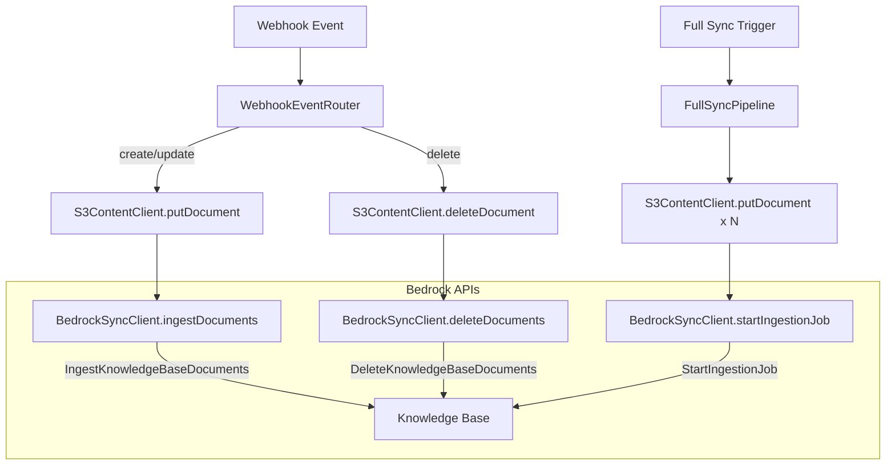
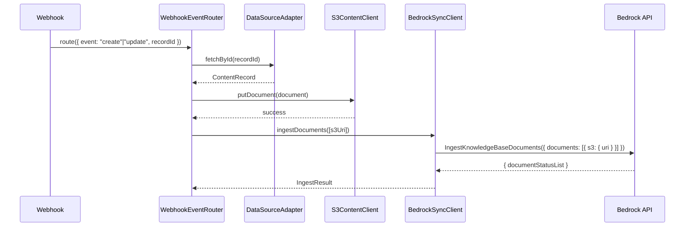
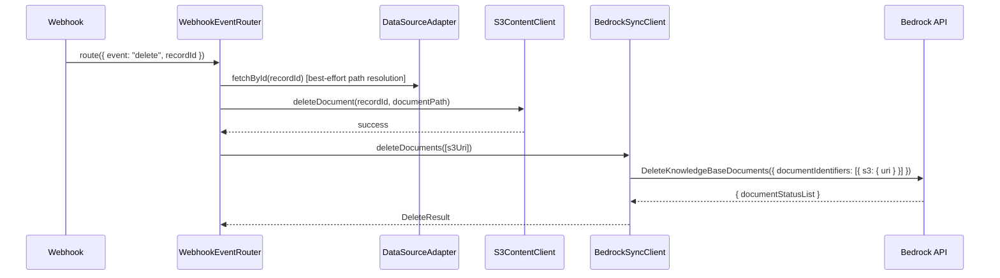

# Design Document: Incremental KB Document Ingestion

## Overview

This feature replaces the full data source scan (`StartIngestionJob`) in the webhook event path with targeted document-level ingestion and deletion APIs. When a single document is created, updated, or deleted via a webhook, the system will use `IngestKnowledgeBaseDocuments` or `DeleteKnowledgeBaseDocuments` to index only that specific document, avoiding a full S3 scan.

The `FullSyncPipeline` continues to use `StartIngestionJob` since bulk operations benefit from a full data source scan. The `BedrockSyncClient` retains `startIngestionJob()` as a fallback and adds two new methods for targeted operations.

## Architecture



## Sequence Diagrams

### Webhook Create/Update Flow (New)



### Webhook Delete Flow (New)



## Components and Interfaces

### Component 1: BedrockSyncClient (Extended)

**Purpose**: Wraps all Bedrock KB ingestion APIs - full scan, targeted ingest, and targeted delete.

**Interface**:

```typescript
interface IngestDocumentResult {
  uri: string;
  status:
    | "INDEXED"
    | "PARTIALLY_INDEXED"
    | "PENDING"
    | "FAILED"
    | "METADATA_PARTIALLY_INDEXED"
    | "IGNORED";
  statusReason?: string;
}

interface DeleteDocumentResult {
  uri: string;
  status: "DELETED" | "FAILED";
  statusReason?: string;
}

interface BedrockSyncClient {
  /** Full data source scan (existing - unchanged). */
  startIngestionJob(): Promise<string>;

  /** Ingest specific documents by S3 URI. Max 10 per call. */
  ingestDocuments(s3Uris: string[]): Promise<IngestDocumentResult[]>;

  /** Delete specific documents from the KB by S3 URI. Max 10 per call. */
  deleteDocuments(s3Uris: string[]): Promise<DeleteDocumentResult[]>;
}
```

**Responsibilities**:

- Construct S3 document source objects from URIs
- Call `IngestKnowledgeBaseDocumentsCommand` for targeted ingestion
- Call `DeleteKnowledgeBaseDocumentsCommand` for targeted deletion
- Return per-document status results
- Validate that no more than 10 URIs are passed per call

### Component 2: WebhookEventRouter (Modified)

**Purpose**: Routes webhook events to appropriate handlers. Now uses targeted APIs instead of full ingestion jobs.

**Changes**:

- `handleUpsert`: Replace `startIngestionJob()` with `ingestDocuments([s3Uri])`
- `handleDelete`: Replace `startIngestionJob()` with `deleteDocuments([s3Uri])`
- Both methods need to construct the S3 URI from bucket name and document key

**S3 URI Construction**:

```typescript
// Construct from bucket name (env var) and document key
const s3Uri = `s3://${bucketName}/${documentKey}`;
```

### Component 3: IngestionLambda CDK Construct (Modified)

**Purpose**: Defines Lambda IAM permissions. Needs new Bedrock API permissions.

**Changes**:

- Add `bedrock:IngestKnowledgeBaseDocuments` to the IAM policy
- Add `bedrock:DeleteKnowledgeBaseDocuments` to the IAM policy

## Data Models

### IngestKnowledgeBaseDocuments Input (AWS SDK)

```typescript
// SDK command input structure
interface IngestKnowledgeBaseDocumentsInput {
  knowledgeBaseId: string;
  dataSourceId: string;
  documents: Array<{
    dataSourceType: "S3";
    s3: {
      uri: string; // e.g. "s3://bucket-name/documents/collection/slug.json"
    };
  }>;
}
```

### DeleteKnowledgeBaseDocuments Input (AWS SDK)

```typescript
// SDK command input structure
interface DeleteKnowledgeBaseDocumentsInput {
  knowledgeBaseId: string;
  dataSourceId: string;
  documentIdentifiers: Array<{
    dataSourceType: "S3";
    s3: {
      uri: string; // e.g. "s3://bucket-name/documents/collection/slug.json"
    };
  }>;
}
```

### S3 URI Format

```typescript
// Pattern: s3://{DATA_BUCKET_NAME}/{documentPath}
// Where documentPath = document.documentPath ?? `documents/${recordId}.json`
//
// Examples:
//   s3://my-bucket/documents/articles/getting-started.json
//   s3://my-bucket/documents/abc123.json
```

## Key Functions with Formal Specifications

### Function: ingestDocuments()

```typescript
async ingestDocuments(s3Uris: string[]): Promise<IngestDocumentResult[]>
```

**Preconditions:**

- `s3Uris` is a non-empty array
- `s3Uris.length <= 10` (AWS API quota)
- Each URI matches pattern `s3://{bucket}/{key}`
- `knowledgeBaseId` and `dataSourceId` are configured

**Postconditions:**

- Returns one `IngestDocumentResult` per input URI
- Result array length equals input array length
- Each result contains the original URI and a status
- No side effects on S3 content (only KB vector store affected)

### Function: deleteDocuments()

```typescript
async deleteDocuments(s3Uris: string[]): Promise<DeleteDocumentResult[]>
```

**Preconditions:**

- `s3Uris` is a non-empty array
- `s3Uris.length <= 10` (AWS API quota)
- Each URI matches pattern `s3://{bucket}/{key}`
- `knowledgeBaseId` and `dataSourceId` are configured

**Postconditions:**

- Returns one `DeleteDocumentResult` per input URI
- Result array length equals input array length
- Each result contains the original URI and a status
- Documents are removed from KB vector store
- S3 objects are NOT affected (already handled separately)

### Function: buildS3Uri()

```typescript
function buildS3Uri(bucketName: string, documentKey: string): string;
```

**Preconditions:**

- `bucketName` is a non-empty string (valid S3 bucket name)
- `documentKey` is a non-empty string (valid S3 object key)

**Postconditions:**

- Returns string matching pattern `s3://{bucketName}/{documentKey}`
- No trailing or double slashes

## Error Handling

### Error Scenario 1: IngestKnowledgeBaseDocuments API Failure

**Condition**: The Bedrock API call throws (network error, throttling, service error)
**Response**: Log the error with structured logging, re-throw to propagate to Lambda error handling
**Recovery**: The document is already in S3, so a subsequent full sync or retry will eventually index it

### Error Scenario 2: Individual Document Ingest Failure

**Condition**: API succeeds but returns `FAILED` status for a specific document
**Response**: Log a warning with the URI and statusReason; do not throw (other documents may have succeeded)
**Recovery**: The document is in S3, so the next full sync will pick it up

### Error Scenario 3: DeleteKnowledgeBaseDocuments API Failure

**Condition**: The Bedrock API call throws
**Response**: Log the error, re-throw
**Recovery**: The document is already removed from S3; next full sync will reconcile the KB vector store

### Error Scenario 4: URI Array Exceeds 10 Items

**Condition**: Caller passes more than 10 URIs to `ingestDocuments` or `deleteDocuments`
**Response**: Throw a validation error immediately (do not call the API)
**Recovery**: Caller should batch into groups of 10

## Testing Strategy

### Unit Testing Approach

- Mock `BedrockAgentClient.send()` to verify correct command construction
- Test `ingestDocuments` builds proper `IngestKnowledgeBaseDocumentsCommand` payload
- Test `deleteDocuments` builds proper `DeleteKnowledgeBaseDocumentsCommand` payload
- Test `WebhookEventRouter` calls `ingestDocuments` (not `startIngestionJob`) for create/update
- Test `WebhookEventRouter` calls `deleteDocuments` (not `startIngestionJob`) for delete
- Test S3 URI construction with various document paths
- Test validation rejects arrays > 10 items

### Property-Based Testing Approach

**Property Test Library**: fast-check

- S3 URI construction is a pure function suitable for property testing
- Validation logic (array size bounds, URI format) suitable for property testing

### Integration Testing Approach

- CDK assertion tests to verify IAM policy includes new permissions
- CDK snapshot tests to detect unintended infrastructure changes

## Performance Considerations

- `IngestKnowledgeBaseDocuments` indexes only the targeted document, avoiding full S3 scan
- For a corpus of 10,000 documents, this reduces webhook processing from scanning all 10k to processing just 1 document
- API quota: max 10 documents per call (sufficient for single-document webhook events)
- No batching needed for webhook path since events are per-document

## Security Considerations

- New IAM permissions (`bedrock:IngestKnowledgeBaseDocuments`, `bedrock:DeleteKnowledgeBaseDocuments`) scoped to specific KB ARN
- S3 URIs constructed from trusted environment variables and adapter-provided paths
- No user-supplied input directly enters the S3 URI (recordId goes through adapter resolution)

## Dependencies

- `@aws-sdk/client-bedrock-agent` v3.1092+ (already in package.json)
  - `IngestKnowledgeBaseDocumentsCommand`
  - `DeleteKnowledgeBaseDocumentsCommand`
- Existing: `BedrockAgentClient`, `StartIngestionJobCommand`

## Correctness Properties

_A property is a characteristic or behavior that should hold true across all valid executions of a system - essentially, a formal statement about what the system should do. Properties serve as the bridge between human-readable specifications and machine-verifiable correctness guarantees._

### Property 1: S3 URI round-trip construction

_For any_ valid bucket name and document key, constructing an S3 URI and then parsing it back should recover the original bucket name and document key.

**Validates: Requirements 3.1, 3.3**

### Property 2: S3 URI format invariant

_For any_ non-empty bucket name and non-empty document key, the constructed S3 URI always starts with `s3://` and contains no double slashes or trailing slashes beyond the protocol prefix.

**Validates: Requirements 3.2**

### Property 3: Result count preservation

_For any_ valid array of S3 URIs (length 1-10), both `ingestDocuments` and `deleteDocuments` return a result array with the same length as the input array, with each result containing the corresponding input URI.

**Validates: Requirements 1.3, 2.3, 5.1, 5.2**

### Property 4: Batch size validation

_For any_ array of S3 URIs with length > 10 or length 0, both `ingestDocuments` and `deleteDocuments` throw a validation error without making an API call.

**Validates: Requirements 4.1, 4.2, 4.3**

### Property 5: Correct API payload construction

_For any_ valid array of S3 URIs (length 1-10), the BedrockSyncClient constructs the SDK command with the configured knowledgeBaseId, dataSourceId, and one document source object per URI with dataSourceType "S3".

**Validates: Requirements 1.2, 2.2**
