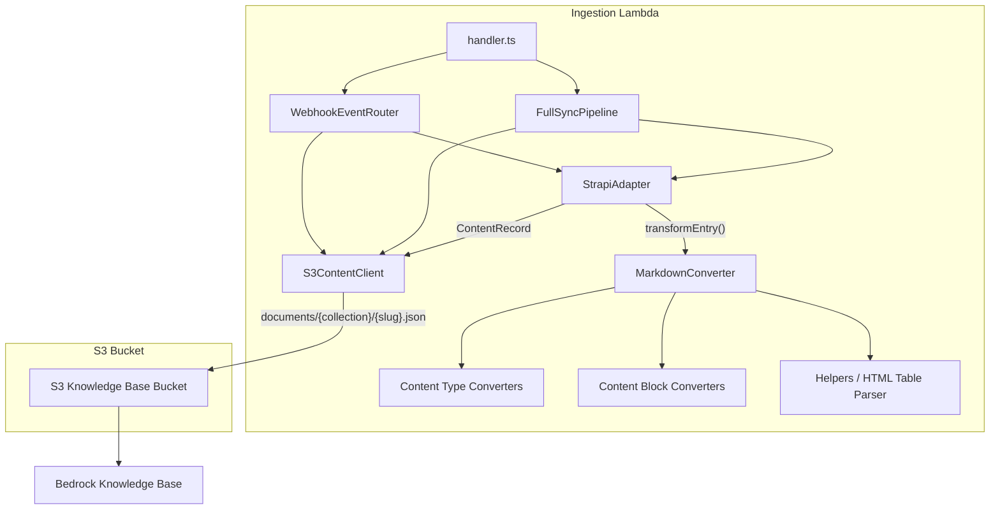
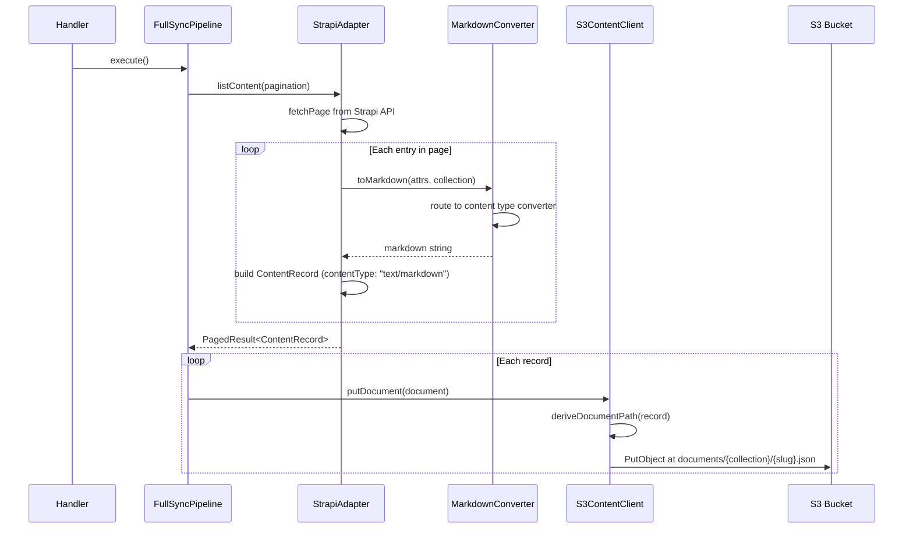
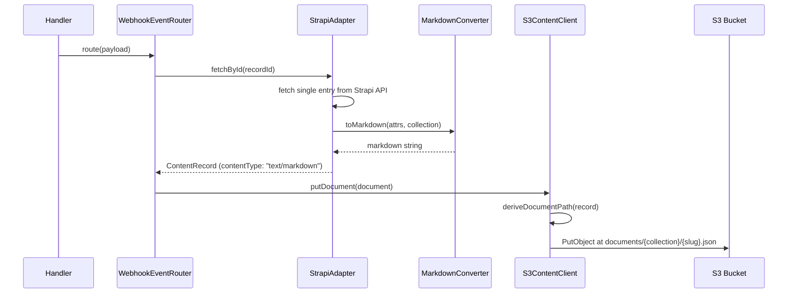

# Design Document: Ingestion Markdown Conversion

## Overview

This feature adds a markdown conversion layer to the existing ingestion Lambda (`infra/lambda/ingestion/`) that transforms Strapi CMS content into well-structured markdown optimized for Bedrock Knowledge Base retrieval. The current system extracts plain text from Strapi dynamic zone blocks via `StrapiAdapter.extractContentBody()` and stores documents at `documents/{recordId}.json`. The new system will produce rich markdown with headings, metadata, lists, and properly formatted content blocks, and store documents at `documents/{collection}/{slug-or-name}.json`.

The conversion logic is ported from the old export service (`lib/export/`) but stripped of Next.js dependencies, external HTTP calls, and content types not relevant to the 3 supported collections (intranet-pages, intranet-teams, intranet-people). The MarkdownConverter integrates into the StrapiAdapter's `transformEntry()` method, meaning the FullSyncPipeline and WebhookEventRouter require zero code changes.

## Architecture



## Data Flow

### Full Sync Path



### Webhook Path



## File Structure

```
infra/lambda/ingestion/
├── handler.ts                    (unchanged)
├── sync-pipeline.ts              (unchanged)
├── event-router.ts               (unchanged)
├── strapi-adapter.ts             (modified - calls MarkdownConverter)
├── s3-client.ts                  (modified - accepts documentPath override)
├── types.ts                      (modified - add documentPath to S3ContentDocument)
├── markdown-converter/
│   ├── index.ts                  (MarkdownConverter class - main entry point)
│   ├── content-types.ts          (convertPage, convertTeam, convertPerson)
│   ├── content-blocks.ts         (convertContentBlock router + all block converters)
│   └── helpers.ts                (formatMetadata, formatImage, formatLink, parseHTMLTableToMarkdown, etc.)
└── ... (other existing files unchanged)
```

## Components and Interfaces

### Component 1: MarkdownConverter

**Purpose**: Main entry point that routes content to the appropriate content-type converter.

**Interface**:

```typescript
export class MarkdownConverter {
  /**
   * Converts Strapi entry data to markdown.
   * Routes to the appropriate content-type converter based on contentType.
   * Returns empty string for null/undefined data.
   * Returns error fallback markdown on conversion failure.
   */
  static toMarkdown(
    data: Record<string, unknown> | null | undefined,
    contentType: string,
  ): string;

  /** Generic fallback converter for unknown content types. */
  private static genericConvert(
    data: Record<string, unknown>,
    contentType: string,
  ): string;

  /** Error fallback - minimal markdown with error info. */
  private static errorFallback(
    data: Record<string, unknown>,
    contentType: string,
    error: Error,
  ): string;
}
```

**Responsibilities**:

- Null/undefined guard returning empty string
- Route to `convertPage`, `convertTeam`, or `convertPerson` based on contentType
- Fall back to generic converter for unknown types
- Catch errors and return error fallback markdown

### Component 2: Content Type Converters

**Purpose**: Produce page-level markdown for each of the 3 supported collections.

**Interface**:

```typescript
/** Convert intranet-pages entries to markdown. */
export function convertPage(data: Record<string, unknown>): string;

/** Convert intranet-teams entries to markdown. */
export function convertTeam(data: Record<string, unknown>): string;

/** Convert intranet-people entries to markdown. */
export function convertPerson(data: Record<string, unknown>): string;
```

**Responsibilities**:

- Extract title/name as H1 heading
- Generate metadata section via `formatMetadata()`
- Extract summary, bio, and structured fields
- Iterate over `content_blocks` dynamic zone and call `convertContentBlock()` for each
- Handle sidebar_blocks for pages
- Construct source URL from slug

### Component 3: Content Block Converters

**Purpose**: Convert individual Strapi dynamic zone components to markdown fragments.

**Interface**:

```typescript
/** Routes a content block to the appropriate converter based on __component field. */
export function convertContentBlock(block: ContentBlock): string;

/** Supported block types (subset relevant to 3 collections): */
// dynamic.text-block
// dynamic.changeling-text-block
// dynamic.accordion
// dynamic.50-50-text-n-image
// dynamic.double-text-block
// dynamic.photos-block
// dynamic.shuffled-photo
// dynamic.table
// sidebar.link-block
// sidebar.document-block
// dynamic.columns-link-block
// intranet-blocks.link-cards
// dynamic.image-and-cta-block
// intranet-blocks.quote-of-the-week
// dynamic.wins-and-shoutouts
// dynamic.about-me
```

**Responsibilities**:

- Route based on `__component` discriminator field
- Convert each block type to appropriate markdown (headings, lists, links, tables, images)
- Return empty string for null/empty blocks
- Fall back to extracting text/title/summary fields for unknown block types
- No external HTTP calls (unlike the old export service's dynamic data blocks)

### Component 4: Helpers

**Purpose**: Shared formatting utilities used by content-type and content-block converters.

**Interface**:

```typescript
/** Format metadata section with bold-labeled key-value pairs. */
export function formatMetadata(
  data: Record<string, unknown>,
  contentType: string,
  sourceUrl?: string,
): string;

/** Extract best title from various Strapi field patterns. */
export function extractTitle(data: Record<string, unknown>): string;

/** Format a markdown link with optional external indicator. */
export function formatLink(
  text: string,
  url: string,
  targetBlank?: boolean,
): string;

/** Format a markdown image with alt text and optional caption. */
export function formatImage(image: StrapiImage): string;

/** Format a file/document attachment reference. */
export function formatFile(file: StrapiFile): string;

/** Parse HTML table string into markdown table format. */
export function parseHTMLTableToMarkdown(html: string): string;

/** Trim and normalize text from Strapi rich text fields. */
export function cleanMarkdownText(text: string): string;

/** Normalize Strapi tags (array or comma-separated string) to string[]. */
export function normalizeTags(tags: unknown): string[];

/** Convert a title/name string to a URL-safe slug. */
export function toSlug(value: string): string;
```

### Component 5: S3ContentClient (Modified)

**Purpose**: Persist and delete content documents in S3, now with configurable document paths.

**Interface changes**:

```typescript
export class S3ContentClient {
  /**
   * Persists a content document to S3.
   * Uses document.documentPath if provided, otherwise falls back to
   * documents/{recordId}.json for backwards compatibility.
   */
  async putDocument(document: S3ContentDocument): Promise<void>;

  /**
   * Deletes a content document from S3.
   * Uses documentPath if provided, otherwise falls back to
   * documents/{recordId}.json.
   */
  async deleteDocument(recordId: string, documentPath?: string): Promise<void>;
}
```

### Component 6: StrapiAdapter (Modified)

**Purpose**: Transforms Strapi entries into ContentRecords, now using MarkdownConverter.

**Changes to `transformEntry()`**:

```typescript
private transformEntry(entry: StrapiEntry): ContentRecord | null {
  // ... existing ID extraction and validation ...

  const attrs = this.extractAttributes(entry);

  // NEW: Use MarkdownConverter for content body
  const markdownBody = MarkdownConverter.toMarkdown(attrs, this.config.collection);

  let contentBody: string;
  let contentType: string;

  if (markdownBody.length > 0) {
    contentBody = markdownBody;
    contentType = "text/markdown";
  } else {
    // Fallback to existing plain text extraction
    contentBody = this.extractContentBody(attrs);
    contentType = "text/plain";
  }

  if (!contentBody || contentBody.length > MAX_CONTENT_BODY_SIZE) {
    return null;
  }

  // ... existing lastModified and metadata extraction ...

  // NEW: Compute documentPath for S3
  const documentPath = this.deriveDocumentPath(attrs, recordId);

  return {
    recordId,
    contentBody,
    contentType,
    metadata: { ...metadata, documentPath },
    lastModified,
  };
}

/**
 * Derives the S3 document path for a content record.
 * Format: documents/{collection}/{slug-or-name}.json
 */
private deriveDocumentPath(attrs: Record<string, unknown>, recordId: string): string {
  const collection = this.config.collection;
  let filename: string;

  if (typeof attrs["slug"] === "string" && attrs["slug"].length > 0) {
    filename = attrs["slug"];
  } else if (typeof attrs["title"] === "string" && attrs["title"].length > 0) {
    filename = toSlug(attrs["title"]);
  } else if (typeof attrs["name"] === "string" && attrs["name"].length > 0) {
    filename = toSlug(attrs["name"]);
  } else {
    filename = recordId;
  }

  return `documents/${collection}/${filename}.json`;
}
```

## Data Models

### ContentBlock (new type)

```typescript
/** A Strapi dynamic zone component with __component discriminator. */
export interface ContentBlock {
  __component: string;
  text?: string;
  title?: string;
  summary?: string;
  subTitle?: string;
  items?: ContentBlock[];
  textBlock?: string | ContentBlock[];
  left?: ContentBlock;
  right?: ContentBlock;
  leftColumnTitle?: string;
  leftColumnBody?: string;
  rightColumnTitle?: string;
  rightColumnBody?: string;
  links?: Array<{ text?: string; url?: string; target_blank?: boolean }>;
  files?: { data?: Array<{ attributes?: StrapiFile }> };
  photos?: { data?: Array<{ attributes?: StrapiImage }> };
  cards?: Array<{
    title?: string;
    link?: string;
    icon?: { data?: { attributes?: StrapiImage } };
    color?: string;
  }>;
  table?: string;
  [key: string]: unknown;
}
```

### StrapiImage / StrapiFile (helper types)

```typescript
export interface StrapiImage {
  url?: string;
  alternativeText?: string;
  caption?: string;
  name?: string;
  width?: number;
  height?: number;
}

export interface StrapiFile {
  url?: string;
  name?: string;
  size?: number;
  mime?: string;
  ext?: string;
}
```

### S3ContentDocument (modified)

```typescript
export interface S3ContentDocument {
  recordId: string;
  contentBody: string;
  contentType: string; // now "text/markdown" or "text/plain"
  sourceType: string;
  metadata: S3ContentMetadata;
  documentPath?: string; // NEW: override for S3 key
}
```

## S3 Key Derivation Logic

The S3 document path is derived at the adapter level and passed through the pipeline:

1. **Slug available** (most intranet-pages, teams): Use slug directly  
   `documents/intranet-pages/about-us.json`

2. **No slug, but title/name** (some people entries): Convert to slug  
   `documents/intranet-people/jane-doe.json`  
   Conversion: lowercase, replace spaces/special chars with hyphens, collapse multiple hyphens, strip leading/trailing hyphens

3. **Neither available** (edge case): Fall back to recordId  
   `documents/intranet-teams/42.json`

The `toSlug()` helper:

```typescript
export function toSlug(value: string): string {
  return value
    .toLowerCase()
    .replace(/[^a-z0-9\s-]/g, "") // remove special characters
    .replace(/\s+/g, "-") // spaces to hyphens
    .replace(/-+/g, "-") // collapse multiple hyphens
    .replace(/^-|-$/g, ""); // trim leading/trailing hyphens
}
```

## HTML Table Parsing

The table converter handles Strapi's `dynamic.table` component which stores HTML table markup in a `table` field. The parser converts this to markdown tables using lightweight regex/string parsing (no DOM library required):

**Algorithm**:

```typescript
export function parseHTMLTableToMarkdown(html: string): string {
  // 1. Split HTML into rows by matching <tr>...</tr> blocks
  // 2. For each row, extract cells by matching <th> or <td> tags
  // 3. Strip inner HTML tags from cell content, decode &nbsp; entities
  // 4. Determine header: use <th> cells if present, else first row
  // 5. Build markdown table:
  //    - Header row: | col1 | col2 | col3 |
  //    - Separator:  | --- | --- | --- |
  //    - Data rows:  | val1 | val2 | val3 |
  // 6. If parsing fails (no rows extracted), wrap raw HTML in code block as fallback
}
```

**Parsing approach**:

- Use regex `/<tr[^>]*>([\s\S]*?)<\/tr>/gi` to extract row content
- Use regex `/<t[hd][^>]*>([\s\S]*?)<\/t[hd]>/gi` to extract cell content within each row
- Strip remaining HTML tags with `/<[^>]+>/g`
- Replace `&nbsp;` with space, `&amp;` with `&`, `&lt;`/`&gt;` with `<`/`>`
- No external dependencies needed (no cheerio, no jsdom)

**Fallback**: If regex extraction yields zero rows, wrap the original HTML in a markdown code block:

````markdown
```html
<table>
  ...
</table>
```
````

```

## Error Handling

### Null/Undefined Data

**Condition**: `MarkdownConverter.toMarkdown()` called with null or undefined
**Response**: Returns empty string immediately
**Recovery**: StrapiAdapter falls back to existing `extractContentBody()` method

### Unknown Content Type

**Condition**: Collection name doesn't match pages/teams/people
**Response**: Generic converter extracts title + common text fields
**Recovery**: Produces minimal but valid markdown

### Conversion Error

**Condition**: Any unhandled exception during conversion
**Response**: Returns error fallback markdown with title, content type, error message, and raw JSON data
**Recovery**: Document still gets stored (with degraded quality) rather than being dropped

### HTML Table Parse Failure

**Condition**: Regex extraction produces zero rows from HTML table
**Response**: Wraps raw HTML in a code block
**Recovery**: Content is preserved verbatim for manual review

## Testing Strategy

### Unit Testing Approach

- Test each content-type converter with representative Strapi entry fixtures
- Test each content-block converter independently with fixture data
- Test `parseHTMLTableToMarkdown` with various HTML table structures
- Test `toSlug` with edge cases (special chars, unicode, empty strings)
- Test StrapiAdapter integration: verify markdown output and fallback behavior
- Test S3ContentClient path derivation logic

### Property-Based Testing Approach

**Property Test Library**: fast-check

Properties should validate:
- Round-trip stability of slug generation
- HTML table parser always produces valid markdown table format or code block fallback
- MarkdownConverter never throws (always returns a string)
- Content block converter handles arbitrary nested structures without stack overflow

### Integration Testing Approach

- End-to-end test: feed real Strapi API response fixtures through StrapiAdapter and verify S3 document format
- Verify FullSyncPipeline produces markdown ContentRecords without code changes
- Verify WebhookEventRouter handles markdown ContentRecords without code changes

## Performance Considerations

- Markdown conversion adds string concatenation overhead but no I/O. Target: <50ms per record for typical pages with 10-20 content blocks.
- HTML table parsing uses regex (O(n) where n is HTML length). No DOM construction overhead.
- No async operations in the converter (unlike the old export service which fetched dynamic data). All converters are synchronous.
- The Lambda timeout constraint of 500ms additional processing per record is easily met since there are no network calls in conversion.

## Dependencies

- **No new npm packages required**. All conversion is done with built-in string operations and regex.
- The old export service used `html-entities` for HTML decoding. The new converter handles basic entity decoding (`&nbsp;`, `&amp;`, `&lt;`, `&gt;`) inline without a dependency.
- Node.js 20.x built-in `Buffer` and string methods are sufficient.

## Correctness Properties

*A property is a characteristic or behavior that should hold true across all valid executions of a system - essentially, a formal statement about what the system should do. Properties serve as the bridge between human-readable specifications and machine-verifiable correctness guarantees.*

### Property 1: MarkdownConverter never throws

*For any* input (including null, undefined, empty objects, deeply nested structures, and malformed data), calling `MarkdownConverter.toMarkdown(data, contentType)` SHALL always return a string (never throw an exception).

**Validates: Requirements 1.2, 1.4**

### Property 2: Non-empty input produces non-empty markdown

*For any* valid Strapi entry with at least one non-empty text field (title, name, summary, bio, or content_blocks with text), `MarkdownConverter.toMarkdown(data, contentType)` SHALL return a non-empty string.

**Validates: Requirements 1.1, 2.1, 2.2, 2.3**

### Property 3: HTML table parser produces valid markdown table or code block

*For any* non-empty HTML string, `parseHTMLTableToMarkdown(html)` SHALL return either a valid markdown table (containing at least one `|` separator and one `---` separator line) or a fenced code block wrapping the original HTML.

**Validates: Requirements 9.1, 9.2, 9.3, 9.4**

### Property 4: Slug generation is idempotent

*For any* string input, applying `toSlug()` twice SHALL produce the same result as applying it once (i.e., `toSlug(toSlug(x)) === toSlug(x)`).

**Validates: Requirements 6.2, 6.3**

### Property 5: S3 document path is always well-formed

*For any* Strapi entry attributes and recordId, the derived document path SHALL match the pattern `documents/{collection}/{non-empty-filename}.json` where filename contains only lowercase alphanumeric characters and hyphens.

**Validates: Requirements 6.1, 6.2, 6.3, 6.4**

### Property 6: Markdown contentType is set correctly

*For any* Strapi entry where MarkdownConverter produces a non-empty result, the resulting ContentRecord SHALL have `contentType` set to `"text/markdown"`. For any entry where MarkdownConverter returns empty string, the ContentRecord SHALL have `contentType` set to `"text/plain"`.

**Validates: Requirements 5.2, 5.3**

### Property 7: Content block converter handles arbitrary nesting without error

*For any* nested content block structure (accordions containing items, textBlock arrays, left/right sub-components) up to depth 10, `convertContentBlock()` SHALL return a string without throwing.

**Validates: Requirements 3.1, 3.2, 3.4, 3.8**
```
